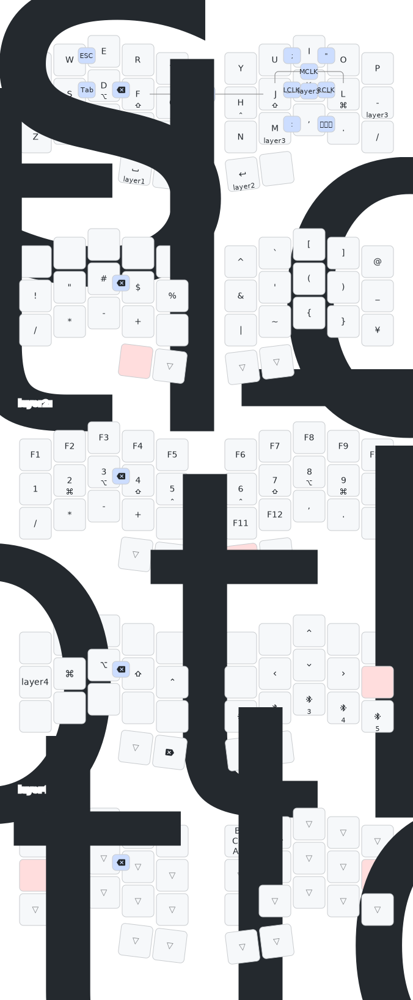

# zmk-config-cheakee

## シールド一覧

| シールド名                         | 説明                                                       |
| ---------------------------------- | ---------------------------------------------------------- |
| cheakee_left                       | 左基板用                                                   |
| cheakee_left_no_ball               | 左基板用（ボールなし）                                     |
| cheakee_right_ball_L               | 右基板用（トラックボール: 左）                             |
| cheakee_right_ball_R               | 右基板用（トラックボール: 右）                             |
| cheakee_right_ball_LR              | 右基板用（トラックボール: 左右）                           |
| cheakee_right_no_ball              | 右基板用（ボールなし）                                     |
| cheakee_left-central_right         | 左をセントラルとする構成の右基板用                         |
| cheakee_left-central_right_no_ball | 左をセントラルとする構成の右基板用（ボールなし）           |
| cheakee_left-central_left_ball_L   | 左をセントラルとする構成の左基板用（トラックボール: 左）   |
| cheakee_left-central_left_ball_R   | 左をセントラルとする構成の左基板用（トラックボール: 右）   |
| cheakee_left-central_left_ball_LR  | 左をセントラルとする構成の左基板用（トラックボール: 左右） |
| cheakee_left-central_left_no_ball  | 左をセントラルとする構成の左基板用（ボールなし）           |
