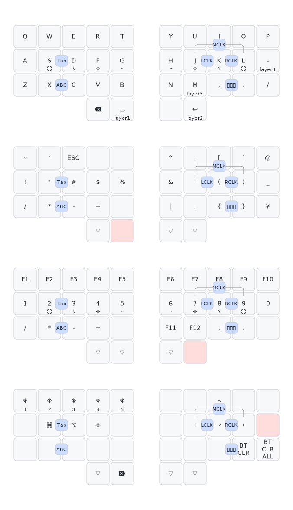

# zmk-config-cheakee



## ファームウェアのローカルでのビルド

### 初回設定

1. Docker ボリュームの作成
   - `docker volume create --driver local -o o=bind -o type=none -o device="$(pwd)" zmk-config`
1. 適当なディレクトリで `git clone https://github.com/zmkfirmware/zmk.git`
1. `cd zmk`
1. `git checkout v0.2.1`
1. VS Code で "Reopen in Container"
1. west のセットアップ
   ```
   west init -l app/ # Initialization
   west update       # Update modules
   ```

### ビルド

1. clone した zmk リポジトリを開発コンテナで開く
1. zmk-config のフォルダを VS Code で開く

   ```
   code /workspaces/zmk-config
   ```

   これでコンテナ上で zmk-config-cheakee が開かれる

1. この開発コンテナ上で `./build.sh` を実行
